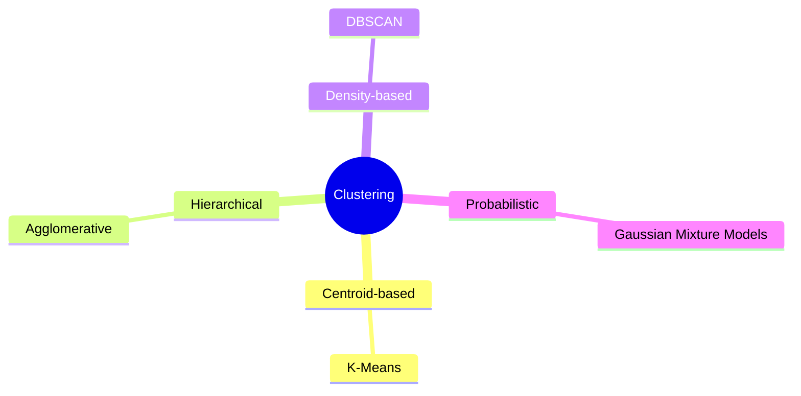

# Clustering Research Lab

> Research, experiments and technical documentation on clustering algorithms.
>
> Machine Learning Bootcamp · Task 5


---

> [!NOTE]
>
> **Developer Notes**
>
> Built under questionable air conditioning.
>
> Barcelona Summer 2026 · AI Bootcamp
>
> 🎧 Playlist: **git push, don't panic**

---

## Project Overview

This repository explores the foundations of **Unsupervised Machine Learning** through the study of the most representative clustering algorithms.

The project combines theoretical research with technical documentation and serves as a practical GitHub lab to learn professional documentation practices using Markdown, Mermaid, GitHub Pages, Wiki, Releases and Git version control.

Instead of following the structure of a traditional academic report, the research is organized as technical documentation, similar to the documentation found in real software projects.

---

## Repository Structure

```text
.
├── docs/
│   ├── fundamentals.md
│   ├── algorithms.md
│   ├── evaluation.md
│   └── conclusions.md
│
├── notebooks/
│
├── images/
│
├── README.md
├── mkdocs.yml
└── LICENSE
```

---

## Research Roadmap

This repository answers the following research topics:

- Unsupervised Learning
- Clustering Fundamentals
- Centroid-Based Clustering
- Hierarchical Clustering
- Density-Based Clustering
- Cluster Evaluation
- K-Means
- Agglomerative Clustering
- DBSCAN
- Gaussian Mixture Models (GMM)

---

## Clustering Landscape



---

## Documentation

| Document | Description |
|----------|-------------|
| Fundamentals | Introduction to Unsupervised Learning and Clustering |
| Algorithms | Study of K-Means, Hierarchical Clustering, DBSCAN and GMM |
| Evaluation | Elbow Method and Silhouette Score |
| Conclusions | Comparison, advantages, limitations and applications |

The complete documentation is available in the **docs/** directory and will also be published through **GitHub Pages**.

---

## Technologies

- Git
- GitHub
- Markdown
- Mermaid
- MkDocs
- Python
- Jupyter Notebook

---

## Project Status

- [x] Repository initialized
- [x] Documentation structure
- [ ] Complete theoretical research
- [ ] Practical notebook
- [ ] GitHub Pages
- [ ] GitHub Wiki
- [ ] Release v1.0.0

---

## References

- Bishop, C. M. *Pattern Recognition and Machine Learning.*
- Ester, M., Kriegel, H. P., Sander, J., & Xu, X. *A Density-Based Algorithm for Discovering Clusters in Large Spatial Databases with Noise.*
- James, G., Witten, D., Hastie, T., & Tibshirani, R. *An Introduction to Statistical Learning.*
- MacQueen, J. *Some Methods for Classification and Analysis of Multivariate Observations.*
- Rousseeuw, P. J. *Silhouettes: A Graphical Aid to the Interpretation and Validation of Cluster Analysis.*

---

## Author

**Gaby Granja**

Machine Learning Bootcamp · 2026