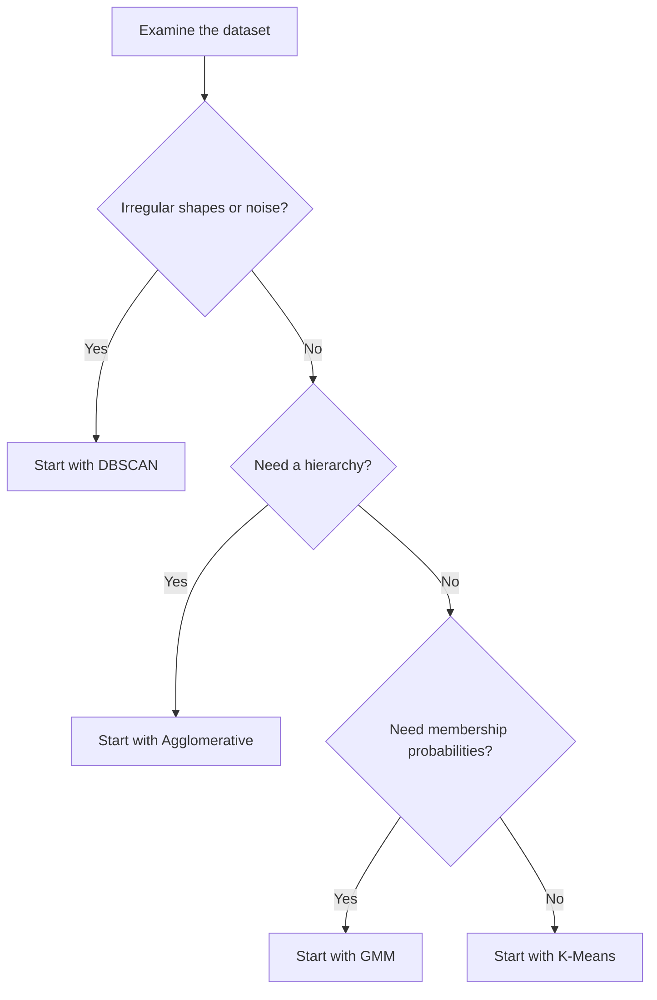

# Clustering Approaches

> **Estimated reading time:** 6 min 
> **Prerequisites:** Fundamentals 
> **Related topics:** Similarity, Distance Metrics, Cluster Geometry

---

## Overview

Clustering methods differ in how they define a group and how they assign observations to it. Some represent clusters through central points, others build nested structures, identify dense regions or estimate probability distributions.

These approaches are complementary rather than interchangeable. Their assumptions determine which patterns they can recover and how their results should be interpreted.

---

## Learning Objectives

After reading this section you will be able to:

- Distinguish centroid-based, hierarchical, density-based and probabilistic clustering.
- Relate each approach to its underlying assumptions.
- Recognize the types of cluster geometry each approach can identify.
- Select an appropriate family of methods for an initial experiment.

---

## Centroid-Based Clustering

Centroid-based methods represent each cluster with a central point. Every observation is assigned to the cluster whose centroid is closest according to a distance metric.

**K-Means** is the most widely used example. It iteratively assigns observations to centroids and updates those centroids until the assignments stabilize.

### Assumptions

- Clusters are compact and approximately spherical.
- Groups have broadly similar sizes and densities.
- The mean is a meaningful representation of a cluster.
- Numerical features are measured on comparable scales.

### Strengths

- Efficient on large datasets.
- Easy to understand and implement.
- Produces clear, non-overlapping assignments.

### Limitations

- Requires the number of clusters in advance.
- Sensitive to initialization, feature scaling and outliers.
- Cannot reliably recover complex or irregular cluster shapes.

---

## Hierarchical Clustering

Hierarchical methods create a nested sequence of clusters. The result describes relationships at several levels of granularity instead of providing only one flat partition.

Two strategies are possible:

- **Agglomerative:** begins with one cluster per observation and repeatedly merges the closest groups.
- **Divisive:** begins with a single cluster and repeatedly divides it into smaller groups.

Agglomerative Clustering is more common in practical machine learning workflows.

### Linkage

The linkage rule defines the distance between two clusters:

| Linkage | Cluster Distance |
|---|---|
| Single | Distance between the closest pair of observations |
| Complete | Distance between the farthest pair of observations |
| Average | Average distance across all pairs |
| Ward | Increase in within-cluster variance after a merge |

Different linkage rules may produce substantially different structures from the same dataset.

### Dendrograms

A dendrogram visualizes the merge hierarchy. The vertical position of each merge represents its distance, allowing an analyst to inspect possible cluster counts and nested relationships.

### Strengths

- Does not require random initialization.
- Reveals multi-level structure.
- Offers several distance and linkage options.

### Limitations

- Can be computationally expensive for large datasets.
- Early merge decisions cannot be reversed.
- Sensitive to noise and the selected linkage rule.

---

## Density-Based Clustering

Density-based methods define clusters as connected regions containing many observations, separated by areas of lower density.

**DBSCAN** is the representative algorithm in this family. It expands clusters from observations whose neighborhoods satisfy a minimum density and labels isolated observations as noise.

### Density Concepts

- A **core point** has enough nearby observations to form part of a dense region.
- A **border point** lies near a core point but does not independently meet the density requirement.
- A **noise point** is not reachable from any dense region.

### Strengths

- Finds clusters with irregular and non-convex shapes.
- Does not require a predefined number of clusters.
- Identifies noise and potential outliers explicitly.

### Limitations

- Sensitive to neighborhood parameters and feature scale.
- Struggles when cluster densities vary substantially.
- Becomes less reliable when distance loses meaning in high-dimensional data.

---

## Probabilistic Clustering

Probabilistic methods assume that observations were generated by a mixture of probability distributions. Instead of assigning each observation exclusively to one group, they estimate a probability of membership for every component.

**Gaussian Mixture Models (GMM)** represent clusters with Gaussian distributions whose means and covariance matrices determine their position, orientation and shape.

### Hard and Soft Membership

| Membership | Interpretation |
|---|---|
| Hard | Each observation belongs to exactly one cluster. |
| Soft | Each observation has a probability of belonging to every cluster. |

Soft membership is useful when cluster boundaries overlap or uncertainty is itself meaningful.

### Strengths

- Represents uncertainty directly.
- Supports elliptical clusters through covariance modeling.
- Provides a flexible density estimate.

### Limitations

- Requires the number of components in advance.
- Relies on distributional assumptions.
- Can be sensitive to initialization and local optima.

---

## Approach Comparison

| Approach | Representative Algorithm | Primary Idea | Best Suited To |
|---|---|---|---|
| Centroid-based | K-Means | Minimize distance to cluster centers | Compact, well-separated groups |
| Hierarchical | Agglomerative | Build a nested merge structure | Relationships at multiple levels |
| Density-based | DBSCAN | Connect dense neighborhoods | Irregular shapes and noisy data |
| Probabilistic | GMM | Model a mixture of distributions | Overlap and uncertain membership |

---

## Selection Guide

This guide provides an initial direction, not a final decision. Real datasets should be explored with more than one algorithm and evaluated using both quantitative metrics and domain knowledge.

---

## Data Preparation Considerations

Most clustering methods depend directly on distances. Before fitting a model:

- Scale numerical features when their ranges differ.
- Review missing values and duplicate observations.
- Investigate outliers and decide whether they are signal or noise.
- Reduce highly redundant or irrelevant features.
- Choose a distance metric appropriate to the data.

Preprocessing is part of the clustering model: changing the representation of the data changes the structure the algorithm can discover.

---

## Key Takeaways

- Clustering approaches encode different definitions of a group.
- Centroid-based methods prioritize distance to a representative center.
- Hierarchical methods reveal nested relationships.
- Density-based methods identify connected dense regions and noise.
- Probabilistic methods quantify uncertainty in cluster membership.
- Data characteristics should guide the initial choice of approach.

---

## Previous

Return to [Fundamentals](fundamentals.md).

## Next

Continue with [Clustering Algorithms](algorithms.md).
