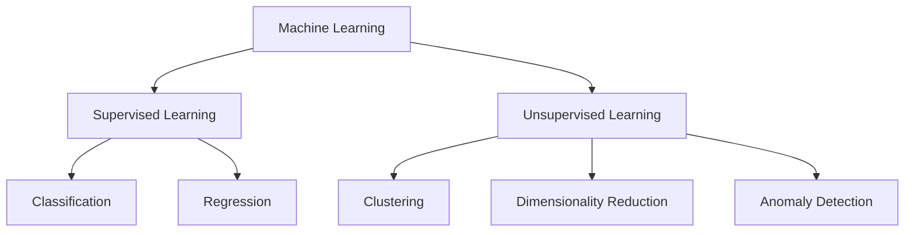

# Fundamentals

## What is Unsupervised Learning?

Unsupervised Learning is a branch of Machine Learning that works with **unlabeled data**. Instead of learning from predefined outputs, algorithms identify hidden patterns, relationships and structures within the dataset.

One of the most common unsupervised learning tasks is **clustering**, where observations are grouped according to their similarity.

---

## Supervised vs. Unsupervised Learning

| Supervised Learning | Unsupervised Learning |
|----------------------|-----------------------|
| Uses labeled data | Uses unlabeled data |
| Predicts known outcomes | Discovers hidden patterns |
| Classification and Regression | Clustering and Dimensionality Reduction |
| Requires ground truth | No ground truth required |

---

## What is Clustering?

Clustering is an unsupervised learning technique that automatically groups similar observations into clusters while maximizing the differences between groups.

The objective is to reveal the natural structure of the data without prior knowledge of the expected categories.

Typical applications include:

- Customer segmentation
- Fraud detection
- Recommendation systems
- Image segmentation
- Market analysis
- Biological data analysis

---

## Machine Learning Overview

---

## Key Takeaways

- Unsupervised Learning works with unlabeled datasets.
- Clustering groups similar observations.
- There is no predefined "correct answer".
- The goal is discovering patterns rather than making predictions.