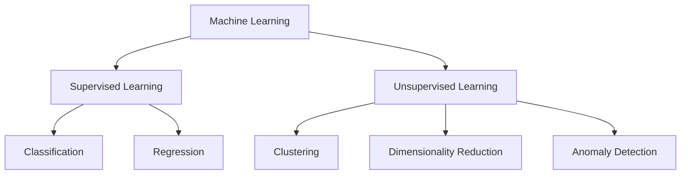

# Fundamentals

> **Estimated reading time:** 4 min  
> **Prerequisites:** None  
> **Related topics:** Clustering, Machine Learning

---

## Overview

Unsupervised Learning is a branch of Machine Learning that analyzes **unlabeled data**. Instead of predicting known outcomes, algorithms discover hidden structures, similarities and relationships within a dataset.

One of its most common applications is **clustering**, where observations are automatically grouped according to their similarity.

---

## Learning Objectives

After reading this section you will be able to:

- Understand the concept of Unsupervised Learning.
- Explain what clustering is.
- Differentiate supervised and unsupervised learning.
- Identify common clustering applications.

---

## What is Unsupervised Learning?

Unlike Supervised Learning, where models learn from labeled examples, Unsupervised Learning receives data without predefined answers.

The algorithm explores the dataset to discover patterns that may not be immediately visible.

Typical objectives include:

- Finding natural groups
- Detecting anomalies
- Reducing dimensionality
- Discovering hidden relationships

---

## Supervised vs. Unsupervised Learning

| Supervised Learning | Unsupervised Learning |
|----------------------|-----------------------|
| Uses labeled data | Uses unlabeled data |
| Predicts known outcomes | Discovers hidden patterns |
| Classification & Regression | Clustering & Dimensionality Reduction |
| Requires ground truth | No ground truth required |

---

## What is Clustering?

Clustering is an unsupervised learning technique that groups similar observations into clusters while maximizing the differences between groups.

Unlike classification, the algorithm does not know the categories beforehand. Instead, it discovers the underlying structure directly from the data.

Common applications include:

- Customer segmentation
- Fraud detection
- Recommendation systems
- Image segmentation
- Biological data analysis
- Market research

---

## Machine Learning Overview

---

## Key Concepts

| Concept | Description |
|---------|-------------|
| Observation | A single data sample. |
| Feature | A measurable attribute describing an observation. |
| Cluster | A group of similar observations. |
| Similarity | Degree of resemblance between observations. |
| Distance Metric | Mathematical measure used to compare observations. |

---

## Key Takeaways

- Unsupervised Learning works with unlabeled datasets.
- Clustering discovers natural groupings within data.
- No predefined "correct answer" exists.
- The quality of the results depends on both the data and the selected algorithm.

---

## Next

Continue with **Clustering Approaches**, where centroid-based, hierarchical and density-based clustering techniques are introduced.