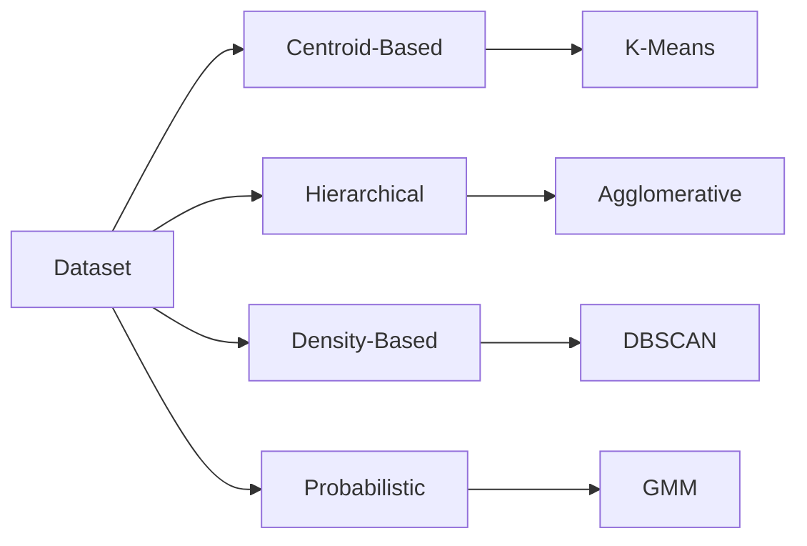

# Clustering Research Lab

Research, experiments and technical documentation on clustering algorithms.

**Machine Learning Bootcamp · Task 5**  
**Author: Gaby Granja**

*Barcelona · Summer 2026*

Research sometimes needs silence.
Sometimes it needs music.

🎧 **Project soundtrack:**  
[git push, don't panic](https://open.spotify.com/playlist/2YD1yp1PxdlyK4xFc0HF07)

## About This Project

This project explores the foundations of unsupervised learning and compares four representative clustering algorithms:

- K-Means
- Agglomerative Clustering
- DBSCAN
- Gaussian Mixture Models

The repository combines theoretical research, visual experiments and technical documentation.

## Documentation

| Section | Content |
|---|---|
| [Fundamentals](fundamentals.md) | Unsupervised learning and clustering concepts |
| [Clustering Approaches](clustering-approaches.md) | Centroid-based, hierarchical and density-based methods |
| [Algorithms](algorithms.md) | Mechanisms, advantages, limitations and applications |
| [Evaluation](evaluation.md) | Elbow Method, Silhouette Score and hyperparameter selection |
| [Conclusions](conclusions.md) | Final comparison and practical recommendations |

## Clustering Landscape



## Practical Experiment

The project includes a reproducible Jupyter Notebook comparing the four clustering algorithms on the same synthetic dataset.

The experiment also includes:

- Elbow Method
- Silhouette Score
- Generated cluster visualizations
- Three-dimensional PCA visualization with the Iris dataset

## Project Structure

```text
.
├── docs/
├── images/
├── notebooks/
├── README.md
├── mkdocs.yml
└── requirements.txt
```

## Technologies

- Python
- Scikit-learn
- Pandas
- NumPy
- Matplotlib
- Jupyter Notebook
- Markdown
- Mermaid
- MkDocs Material
- Git and GitHub

## Start Reading

Continue with [Fundamentals](fundamentals.md).

## Additional Resources

### Project Soundtrack

Some projects deserve a soundtrack.

If you'd like to experience the same atmosphere that accompanied the research, documentation and experiments, you can listen to the project's playlist:

🎧 **git push, don't panic**

https://open.spotify.com/playlist/2YD1yp1PxdlyK4xFc0HF07

> Built during the AI Bootcamp, one commit at a time.
